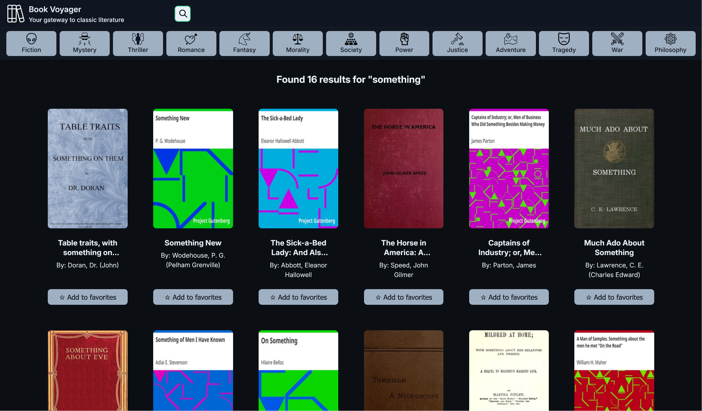

# 📚 Book Voyager / Gutendex 

> A React app that lets you search, explore, and favorite classic literature using the [Gutendex API](https://gutendex.com/).



---

## ✨ Features

-  🔍 **Search** by title or author with live results from Gutendex
-  📂 **Categories** menu (Fiction, Mystery, Thriller, Romance, Fantasy, etc.)
-  ⭐ **Favorites** with persistence via `localStorage`
-  📖 **Book details** page (cover, author, downloads, subjects, languages, links)
-  📱 **Responsive design** with sticky header and animated category bar
-  🎨 **Custom theme** with accessible colors and clean typography

---

## 🛠️ Tech Stack

-  [React](https://react.dev/) + [Vite](https://vitejs.dev/)
-  [React Router](https://reactrouter.com/) for routing
-  Custom React hooks for favorites (`useFavorites`)
-  CSS Modules for component-scoped styling
-  Gutendex API as data source
-  Deployed via **GitHub Pages**

---

## 📁 Project Structure

src/
├── assets/ # SVG icons, logos, placeholders
├── components/ # Header, Footer, BookCard, Loading, etc.
├── hooks/ # useFavorites.js (localStorage persistence)
├── pages/ # HomePage, SearchResultsPage, CategoryPage, FavoritesPage, etc.
├── App.jsx # Root layout (Header + Footer + Outlet)
├── main.jsx # Entry point, router setup
└── index.css # Global styles

---

## 🚀 Getting Started

### Prerequisites

-  Node.js (>= 18)
-  npm

### Install

```bash
git clone https://github.com/elm042025/Gutendex.git
cd Gutendex
npm install
```

### Development

```bash
npm run dev
```

```bash
npm run build
```

```bash
npm run deploy
```

### 📄 License

MIT License © 2025 [Mohammed]
